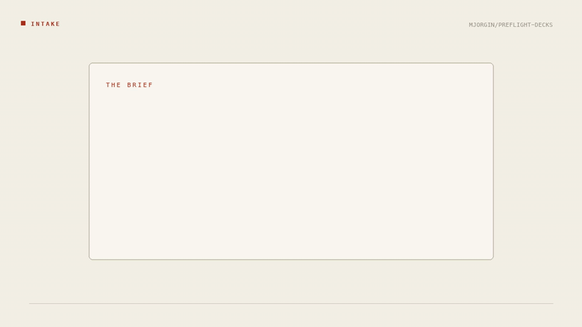
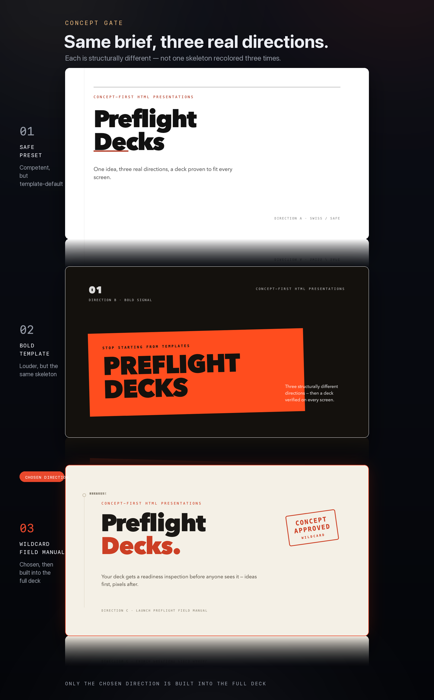

<div align="center">

# ✈️ Preflight Decks

### The concept gate for AI-built presentations.

[](https://github.com/MJorgin/preflight-decks/actions/workflows/ci.yml)
[](LICENSE)


**English** · [**简体中文**](README.zh-CN.md)

Before your agent builds the deck, you get **three structurally different
real previews** and pick on pixels. The chosen direction becomes a
single-file, fixed-stage HTML deck — and a Playwright verifier proves it fits
a 1080p projector and a phone before anyone walks into the room.

[▶ Live demo](https://mjorgin.github.io/preflight-decks/) ·
[Open the source file](./examples/preflight-decks-pitch.html) ·
[See it work](#see-it-work) ·
[How it compares](#how-it-compares) ·
[Install](#install) ·
[Mechanisms](#mechanisms)

</div>



<p align="center"><sub>
20 seconds · intake → three real directions → chosen deck → dual-viewport verification.
Every frame is this repo's own output — the concept-gate previews, the six-slide
<a href="./examples/preflight-decks-pitch.html">example deck</a>, and a real verifier
report: <b>6 slides · 2 viewports · 0 errors · 0 warnings</b>.
Shot on a stage, not on a page: a lateral pan across the three directions, one
continuous push from a 52% panel to full bleed as the chosen direction becomes the
deck, and a pull-back to a static full view. The grammar is measured from
apple.com's product pages — see
<a href="./references/scroll-camera-recipes.md">the shot catalogue</a>.
<a href="./assets/hero-concept-gate.mp4">MP4 version</a> ·
<a href="./docs/hero-film-storyboard.md">storyboard</a>
</sub></p>

> **Dogfooded, not aspirational.** The deck in this README was built through
> the pipeline in this repo, and the README page itself passed the same
> "what does it look like rendered, not imagined" check the skill enforces.

## Try it in 30 seconds — no install

**[Open the live demo →](https://mjorgin.github.io/preflight-decks/)** — the
same file that ships in `examples/`, served straight from `main`. Arrow keys
move through six slides.

Or run it locally:

```bash
# 1. open the deck in any browser, arrow keys to move through 6 slides
open examples/preflight-decks-pitch.html

# 2. run the same verification your decks get
python3 scripts/verify-deck.py examples/preflight-decks-pitch.html
```

One self-contained HTML file. No build step, no network, no framework. The
three pre-build directions are in
[`examples/previews/`](./examples/previews/).

## How it compares

| | Template deck tools | "Make me a deck" in one prompt | **Preflight Decks** |
| --- | --- | --- | --- |
| Where the deck comes from | Pick a theme, pour the content in | One draft, no choice | **Three structurally different rendered directions, then you pick** |
| The usual failure | Beautiful slides, nothing to say | Three "options" that are one skeleton recoloured | The gate makes all three impossible by construction |
| Quality control | None | Vibes | **Six scored dimensions from screenshots; a weak concept vetoes the run** |
| Survives the room? | Untested | Untested | **Playwright-verified at 1280×720 and 390×844** |
| What you ship | A file in someone else's cloud | A file | **One self-contained HTML file, plus optional PDF or live URL** |

Not a template pack, and not a generator: it is the judgment layer that runs
*before* generation and the proof that runs *after* it.

## Why a gate?

Agents make decks fast. The decks still fail exactly where they always did:

1. **Nothing to say** — polished slides wrapped around an argument nobody made.
2. **Three skins** — "style options" that are one skeleton recolored three times.
3. **Fits one screen** — gorgeous on your laptop, overflowing on the projector or a phone.

Preflight Decks makes all three *impossible by construction*: no full deck
exists until you've chosen between three **structurally different** rendered
directions; every draft is scored from screenshots, and a weak concept vetoes
the run however polished the pixels; every finished deck is mechanically
verified at projector and phone sizes.

It is a thin, opinionated **judgment layer** that uses
[frontend-slides](https://github.com/zarazhangrui/frontend-slides) (MIT) as
the delivery chassis — fixed 1920×1080 stage, single HTML file, inline
editing, PDF/URL export, PPTX conversion.

## The pipeline

```
0  Intake        content inventory + speaking vs. reading density
1  Concept gate  one argue-with sentence → 3 real previews → you pick → gate file
2  Build         full deck on the frontend-slides fixed-stage chassis
3  Critique      six-dimension scores from screenshots (bar 7.5, no dim < 6)
4  Verify        scripts/verify-deck.py — zero hard errors or no ship
5  Deliver       one HTML file (+ optional PDF / live URL)
```

## See it work

### 1. Three real directions — not three recolors

The same brief rendered three ways. Only the chosen one gets built.



### 2. The chosen direction becomes the deck

The wildcard — a *launch preflight field manual* — becomes the six-slide pitch
deck, all in one file:

[](./examples/preflight-decks-pitch.html)

### 3. Verified on the room it will actually meet

Every deck is screenshotted at **1280×720** and **390×844** and checked for
overflow, elements escaping the stage, blank slides, and leftover
placeholders:


Exit code `0` = pass, `2` = hard errors, `1` = tooling problem — so the check
works in CI, not just on trust.

## What the gate adds

| Stage | What the skill forces |
| --- | --- |
| **Concept gate** | One sentence worth arguing, a motif grown from the content, and three *structurally different* previews rendered before a full deck exists |
| **Critique loop** | Six scored dimensions from actual screenshots; concept quality can veto the run |
| **Chassis** | Single fixed-stage 1920×1080 HTML file via frontend-slides — no framework, portable, editable inline |
| **Verification** | Playwright at projector + phone size: overflow, escape, blank-slide, and placeholder checks with a CI-shaped exit code |

## Install

The verifier needs Playwright and Chromium:

```bash
python3 -m pip install playwright pillow
python3 -m playwright install chromium
```

One command if you use the [skills](https://skills.sh) CLI:

```bash
npx skills add MJorgin/preflight-decks
```

> **Check the install afterwards.** This skill is not one file — `references/`,
> `templates/`, `scripts/` and `examples/` are all required. If only `SKILL.md`
> landed in your skills directory, your CLI is too old to sync subdirectories
> (≤ 1.5.15 had that bug); upgrade, or use the clone below.

Then clone into your agent's skills directory:

```bash
# Codex (personal)
git clone https://github.com/MJorgin/preflight-decks ~/.codex/skills/preflight-decks

# Claude Code
git clone https://github.com/MJorgin/preflight-decks ~/.claude/skills/preflight-decks

# DeepSeek Harness — bundle plugin
dsh plugin --profile <name> add github:MJorgin/preflight-decks

# DeepSeek Harness — plain skill directory (no plugin step)
git clone https://github.com/MJorgin/preflight-decks ~/.dsh/skills/preflight-decks
```

The skill also needs its chassis peer,
[frontend-slides](https://github.com/zarazhangrui/frontend-slides):

```bash
git clone https://github.com/zarazhangrui/frontend-slides ~/.codex/skills/frontend-slides
# DeepSeek Harness users: ~/.dsh/skills/frontend-slides
```

Any agent that reads `SKILL.md` from a folder can use it — point the agent at
this repository and it will load only the referenced files it needs.
DeepSeek Harness specifics (discovery roots, the 500-char catalog budget,
sandbox notes for the verifier) are in [docs/dsh.md](./docs/dsh.md).

## Say this

```text
Make me a pitch deck for X. Don't build anything until I've picked
from three real, structurally different directions.
```

```text
Critique these slides from rendered screenshots, score all six
dimensions, and re-run the projector + phone verifier.
```

## What's in the box

```text
SKILL.md                         the orchestration contract
references/concept-gate.md       the hard door + three-direction protocol
references/critique-rubric.md    six scored dimensions, veto rules
references/deck-verification.md  what "verified" means and why
templates/direction-approved.md  the gate file the user signs off on
scripts/verify-deck.py           Playwright dual-viewport verifier
scripts/render_readme_hero.py    rebuilds the hero film above
examples/                        the dogfooded deck + its three previews
```

## Mechanisms

Three mechanisms carry the whole skill. Each one exists because skipping it
produced a deck that failed in a specific, repeatable way.

**1 · The concept gate** — [references/concept-gate.md](./references/concept-gate.md).
Before anything is built, the brief has to survive one sentence worth arguing
with, and three directions have to be rendered as real slides. "Structurally
different" is enforced, not encouraged: three recolours of one skeleton fail
the gate, because a choice between recolours is not a choice. The picked
direction gets written to `templates/direction-approved.md`, and only then does
the full deck exist.

**2 · The critique loop** — [references/critique-rubric.md](./references/critique-rubric.md).
Every draft is scored on six dimensions from its own rendered screenshots
(bar 7.5, nothing below 6). Concept quality is a veto: a polished deck built on
a weak argument scores lower than a rough deck with something to say, because
that is the failure the room notices first.

**3 · The verifier** — [references/deck-verification.md](./references/deck-verification.md) and
`scripts/verify-deck.py`. Geometry is checked mechanically at 1280×720 and
390×844: overflow, elements escaping the stage, blank slides, leftover
placeholders, uniform stage scaling. Exit codes are CI-shaped (`0` pass, `2`
hard errors, `1` tooling), so "verified" is a fact about a run, not a claim
about intent.

## Security and data flow

- **Local only.** The skill makes no network calls of its own: no telemetry, no
  accounts, no uploads, no hosted service. The one download is Chromium for
  Playwright at install time (~150 MB).
- **What the verifier touches.** It launches a local Chromium against the deck
  file, screenshots it, and writes images plus `report.json` into
  `<deck>/.preflight-check/`. Nothing leaves the machine.
- **What ships.** Decks are single self-contained HTML files — no CDN calls, no
  fonts fetched at view time, no analytics. A deck opened offline renders
  exactly as verified.
- **Your content stays yours.** The skill reads the files you point it at and
  writes new files; it never posts, publishes or pushes anywhere.

## Limitations

- **Verification needs a real browser stack.** Without Python 3.9+ plus
  Playwright and Chromium, the skill can build a deck but cannot prove it —
  and an unproven deck is not a deliverable here.
- **The chassis is a peer, not a dependency you can skip.**
  [frontend-slides](https://github.com/zarazhangrui/frontend-slides) supplies
  the fixed-stage single-file format, the templates and the export tooling.
- **Geometry, not taste.** The verifier catches what can be measured
  (overflow, escapes, blanks, placeholders); whether a slide is worth watching
  is the critique loop's job, and it is a judgment call by design.
- **No PPTX export here.** PDF and live-URL output come from the chassis;
  editable PPTX conversion is out of scope for this repository.
- **Decks only.** Websites, product prototypes and standalone product films are
  explicitly not what this skill is for.

## Scope

Decks only — pitches, talks, teaching decks, internal reports, PPTX → HTML.
Not websites, product prototypes, or standalone product films.

## Origin

Built while making launch pages for AI coding-agent skills. The decks agents
produced were fast, competent and forgettable: the failure was never the CSS,
it was upstream — no argument, "three options" that were one skeleton
recoloured, or a layout that only worked on the author's laptop and broke on
the projector. Preflight Decks is the gate that got added after the third
time a deck had to be rebuilt from the argument up. Everything in this
README — the six-slide example, the hero film, the verification sheet — came
out of that same pipeline.

## Credits

A thin opinionated layer standing on two MIT-licensed works:

- [zarazhangrui/frontend-slides](https://github.com/zarazhangrui/frontend-slides) —
  fixed-stage single-file deck chassis, templates, export tooling.
- [alchaincyf/huashu-design](https://github.com/alchaincyf/huashu-design) —
  the concept-first methodology and critique mindset behind the references.

Independent community project from the maker of
[github-launch-studio](https://github.com/MJorgin/github-launch-studio); not
affiliated with either upstream.

## Connect

Issues, ideas and deck post-mortems are welcome in
[GitHub Issues](https://github.com/MJorgin/preflight-decks/issues) — the most
useful bug report is a deck that passed the verifier and still failed in the
room.

## License

[MIT](./LICENSE)
