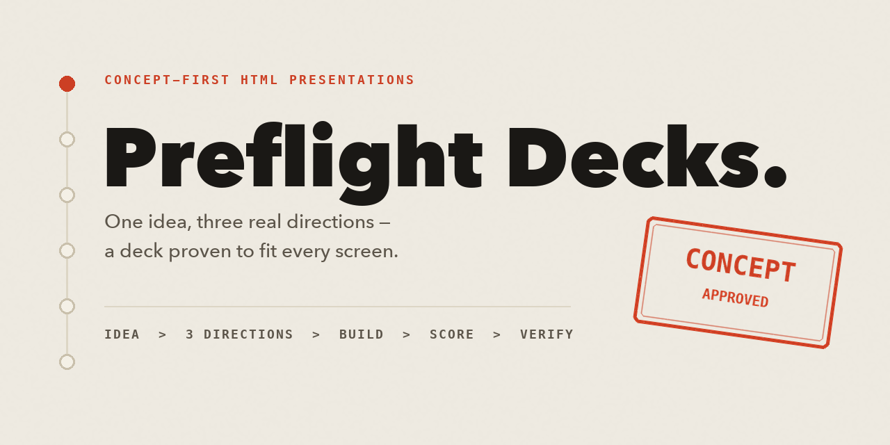

# Preflight Decks

[](https://github.com/MJorgin/preflight-decks/actions/workflows/ci.yml)
[](LICENSE)



**A concept-first director for HTML presentations.** It stops decks from
failing upstream: no idea, three "options" that are one skeleton recolored,
or a beautiful layout that overflows on the projector or a phone.

Preflight Decks is a thin orchestration skill. It owns the judgment layer
and mechanical verification, and uses
[frontend-slides](https://github.com/zarazhangrui/frontend-slides) (MIT) as
the delivery chassis: fixed 1920×1080 stage, single self-contained HTML
file, inline editing, PDF/URL export, PPTX conversion.

## See it work

The same brief produces three **structurally different** real previews —
not one skeleton in three colors. The user chooses on pixels, and only the
chosen direction is built into the full deck:


The chosen wildcard direction — a "launch preflight field manual" — becomes a
six-slide pitch deck, rendered here from the actual example file in this
repo:

[](./examples/preflight-decks-pitch.html)

Every deck then passes a Playwright verifier at projector and phone sizes.
The example deck scores **6 slides, 0 errors, 0 warnings**:


Try it in 30 seconds — open
[`examples/preflight-decks-pitch.html`](./examples/preflight-decks-pitch.html)
in a browser (arrow keys to navigate). The three concept-gate
previews live in [`examples/previews/`](./examples/previews/). Then run:

```bash
python3 scripts/verify-deck.py examples/preflight-decks-pitch.html
```

## Why

Most deck skills sell templates. The default failure is not ugly slides —
it is a competent deck with nothing to say, or a layout that only works on
the author's screen. Preflight Decks makes three things mandatory:

1. **Concept Gate** — one sentence worth arguing, a visual motif grown from
   the content, and three *structurally different* real previews before a
   full deck exists.
2. **Critique Loop** — every draft is scored from rendered screenshots; a
   weak concept vetoes the run no matter how polished it is.
3. **Bulletproof chassis** — every deck is a single fixed-stage HTML file
   proven to fit 1280×720 and 390×844 by an automated screenshot check.

## Pipeline

```
0 Intake        content inventory + speaking/reading density
1 Concept Gate  idea sentence → 3 real previews → user picks → gate file
2 Build         full deck on the frontend-slides fixed-stage chassis
3 Critique      six-dimension score → fix → re-score (bar: 7.5, no dim <6)
4 Verify        scripts/verify-deck.py, zero hard errors
5 Deliver       one HTML file (+ optional PDF / live URL)
```

## Install

Codex / Claude Code / any agent that loads skills from a folder:

```bash
# Chassis (required peer skill)
git clone https://github.com/zarazhangrui/frontend-slides \
  ~/.codex/skills/frontend-slides

# This skill
git clone https://github.com/MJorgin/preflight-decks \
  ~/.codex/skills/preflight-decks
```

The verifier needs Playwright + Chromium:

```bash
python3 -m pip install playwright pillow
python3 -m playwright install chromium
```

## Verifier

Run it against any fixed-stage HTML deck:

```bash
python3 scripts/verify-deck.py path/to/deck.html
```

It writes per-slide screenshots (720p + phone), a contact sheet, and
`report.json` into `.preflight-check/`, checking:

- the 1920×1080 stage scales uniformly and stays ~16:9 on a phone;
- no slide overflows and nothing escapes the stage;
- no blank slides, no placeholder/lorem text;
- warns on generic display font stacks.

Exit code: `0` pass (warnings allowed), `2` hard errors, `1` tooling error.

## Scope

Decks only — pitches, talks, teaching, internal reports, PPTX → HTML.
Not websites, product prototypes, or standalone product films.

## Credits

A thin opinionated layer standing on two MIT-licensed works:

- [zarazhangrui/frontend-slides](https://github.com/zarazhangrui/frontend-slides) —
  fixed-stage single-file deck chassis, templates, export tooling.
- [alchaincyf/huashu-design](https://github.com/alchaincyf/huashu-design) —
  the concept-first methodology, critique rubric, and verification mindset
  distilled into this skill's references.

From the maker of [github-launch-studio](https://github.com/MJorgin/github-launch-studio),
a Codex skill for launch-ready open-source repositories. Independent
community project, not affiliated with either upstream.

## License

MIT
