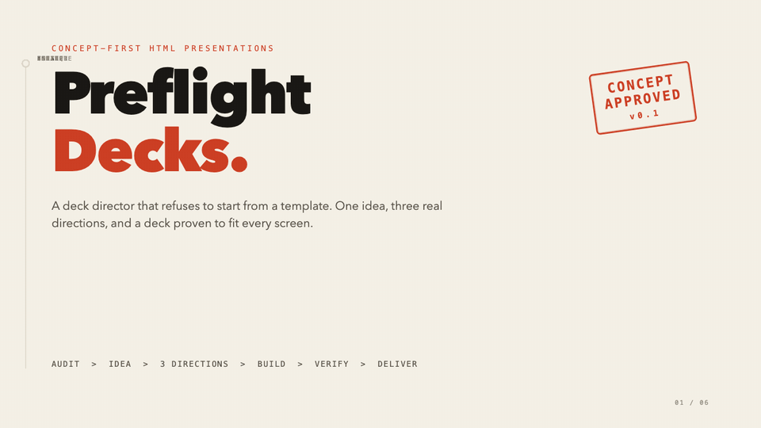
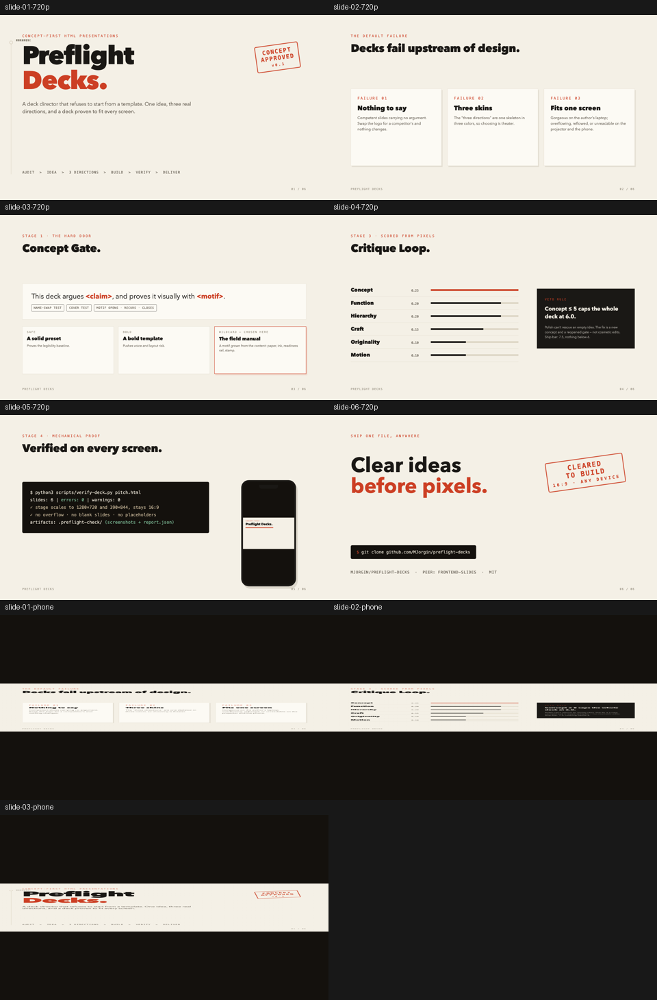

<div align="center">

# ✈️ Preflight Decks

### 给 AI 做的幻灯片，装一道概念门。

[](https://github.com/MJorgin/preflight-decks/actions/workflows/ci.yml)
[](LICENSE)


[**English**](README.md) · **简体中文**

动手做 deck 之前，先拿到**三个结构真正不同的真实预览**，在像素上拍板。
被选中的方向才做成单文件、固定舞台的 HTML deck——再用 Playwright 证明它在
1080p 投影仪和手机上放得下，而不是等人走进会议室才发现崩版。

[▶ 在线落地页](https://mjorgin.github.io/preflight-decks/) ·
[播放 deck](https://mjorgin.github.io/preflight-decks/deck/) ·
[打开源文件](./examples/preflight-decks-pitch.html) ·
[工作原理](#工作原理) ·
[安装](#安装)

</div>


<p align="center"><sub>
20 秒 · 需求 → 三个真实方向 → 选定后成稿 → 双视口验收。
每一帧都是本仓库自己的产物——概念门预览、六页
<a href="./examples/preflight-decks-pitch.html">示例 deck</a>，以及真实的验收报告：
<b>6 页 · 2 个视口 · 0 错误 · 0 警告</b>。
这不是直录屏幕：真实截图被放进悬浮玻璃屏与柔和落地阴影里，只用克制的信号红
标记被选中的方向。镜头依次完成横向滑轨、52% 到满幅的连续推近、投影仪/手机
验收凭据，最后拉回全景停稳；OLED 渐变、稀疏粒子场、透视网格和固定颗粒都与在线
落地页统一。
<a href="./assets/hero-concept-gate.mp4?v=20260918-premium-readme">MP4 版</a> ·
<a href="./docs/hero-film-storyboard.md">分镜卡</a>
</sub></p>

> **自己先吃狗粮。** 这份 README 里的 deck 就是走本仓库的流程做出来的；
> README 这一页本身也过了它强制的那道检查——「看渲染结果，不看想象」。

## 30 秒试用——不用安装

**[打开在线落地页 →](https://mjorgin.github.io/preflight-decks/)**
先看滚动控制的产品介绍；再
[播放六页 deck](https://mjorgin.github.io/preflight-decks/deck/)。
打开 deck 后可用方向键翻页。

或者本地跑：

```bash
# 1. 用浏览器打开 deck，方向键翻六页
open examples/preflight-decks-pitch.html

# 2. 跑一遍你的 deck 也会经历的验收
python3 scripts/verify-deck.py examples/preflight-decks-pitch.html
```

一个自包含的 HTML 文件。没有构建步骤、不联网、不依赖框架。成稿前的三个方向在
[`examples/previews/`](./examples/previews/)。

## 为什么要一道门？

Agent 做 deck 很快，但 deck 翻车的地方一直没变：

1. **没话说**——精致的幻灯片，包着一句没人真的想说的话。
2. **三个皮肤**——所谓「风格选项」是同一副骨架换了三次颜色。
3. **只在一块屏幕上好看**——在你自己电脑上很美，到投影仪或手机上就溢出崩版。

Preflight Decks 让这三件事*在结构上不可能发生*：三个**结构不同**的渲染方向没有选完，
就不存在完整 deck；每一稿都从截图上打分，概念不行直接否决，像素再漂亮也没用；
每一份成稿都在投影仪和手机尺寸下机械验收。

它是一个很薄的判断层，交付底盘复用
[frontend-slides](https://github.com/zarazhangrui/frontend-slides)（MIT）——
固定 1920×1080 舞台、单 HTML 文件、就地编辑、PDF／链接导出、PPTX 转换。

## 工作原理

```
0  需求收集   内容清点 + 讲与读的密度分配
1  概念门     一句能争论的话 → 3 个真实预览 → 你来选 → 落档
2  构建       在 frontend-slides 固定舞台上做成完整 deck
3  评审       从截图给六个维度打分（及格线 7.5，单项不低于 6）
4  验收       scripts/verify-deck.py —— 有硬错误就不交付
5  交付       一个 HTML 文件（可选 PDF／在线链接）
```

## 看它怎么工作

### 1. 三个真实方向——不是三次换色

同一个需求渲染三版。只有被选中的那一版会被做成完整 deck。


### 2. 被选中的方向变成 deck

被选中的自定义方向——一套「发布前飞行检查手册」——扩成六页 pitch deck，全在一个文件里：

[](./examples/preflight-decks-pitch.html)

### 3. 在它真正要面对的场合上验收

每份 deck 都会在 **1280×720** 和 **390×844** 下截图，检查溢出、元素跑出舞台、
空白页和残留占位符：



退出码 `0` = 通过，`2` = 硬错误，`1` = 工具问题——所以这个检查能进 CI，而不是靠信任。

## 这道门加了什么

| 环节 | skill 强制要求 |
| --- | --- |
| **概念门** | 一句值得争论的话、一个从内容里长出来的视觉母题，以及在做完整 deck 之前先渲染三个*结构不同*的预览 |
| **评审环** | 从真实截图给六个维度打分；概念质量可以一票否决 |
| **底盘** | 通过 frontend-slides 产出单个固定舞台 1920×1080 HTML 文件——无框架、可移植、可就地编辑 |
| **验收** | Playwright 在投影仪和手机尺寸下检查溢出、越界、空白页与占位符，并给出 CI 友好的退出码 |

## 安装

验收器需要 Playwright 和 Chromium：

```bash
python3 -m pip install playwright pillow
python3 -m playwright install chromium
```

然后克隆进你的 agent skill 目录：

```bash
# Codex（个人）
git clone https://github.com/MJorgin/preflight-decks ~/.codex/skills/preflight-decks

# Claude Code
git clone https://github.com/MJorgin/preflight-decks ~/.claude/skills/preflight-decks

# DeepSeek Harness —— 作为 bundle 插件
dsh plugin --profile <name> add github:MJorgin/preflight-decks

# DeepSeek Harness —— 作为普通 skill 目录（无需插件步骤）
git clone https://github.com/MJorgin/preflight-decks ~/.dsh/skills/preflight-decks
```

它还需要配套的底盘 skill
[frontend-slides](https://github.com/zarazhangrui/frontend-slides)：

```bash
git clone https://github.com/zarazhangrui/frontend-slides ~/.codex/skills/frontend-slides
# DeepSeek Harness 用户：~/.dsh/skills/frontend-slides
```

任何能从目录里读取 `SKILL.md` 的 agent 都能用——把仓库指给它，它只会加载需要的那几个文件。
DeepSeek Harness 的细节（发现根目录、500 字符目录预算、验收器的沙箱注意事项）见
[docs/dsh.md](./docs/dsh.md)。

## 可以这样对它说

```text
帮我做一份 X 的 pitch deck。先别动手，
给我三个结构真正不同的真实方向，选完再建。
```

```text
从渲染截图评审这几页，六个维度都打分，
然后重跑投影仪 + 手机的验收。
```

## 仓库里有什么

```text
SKILL.md                         编排契约
references/concept-gate.md       硬门 + 三方向协议
references/critique-rubric.md    六个评分维度、否决规则
references/deck-verification.md  「验收」验的是什么、为什么
templates/direction-approved.md  用户签字确认的落档文件
scripts/verify-deck.py           Playwright 双视口验收器
scripts/check_launch_motion.py   落地页正常/减少动态模式验收
scripts/render_readme_hero.py    重出上面那支英雄片
examples/                        走完全流程的示例 deck + 三个方向的预览
```

## 适用范围

只做 deck——pitch、演讲、教学、内部汇报、PPTX → HTML。
不做网站、产品原型，也不做独立产品片。

## 致谢

一个很薄、有主张的层，站在两个 MIT 项目上：

- [zarazhangrui/frontend-slides](https://github.com/zarazhangrui/frontend-slides)——
  固定舞台单文件 deck 底盘、模板、导出工具。
- [alchaincyf/huashu-design](https://github.com/alchaincyf/huashu-design)——
  references 里的概念先行方法论与评审思维。

来自 [github-launch-studio](https://github.com/MJorgin/github-launch-studio) 作者的独立社区项目，
与上述两个上游没有隶属关系。

## 许可

[MIT](./LICENSE)
